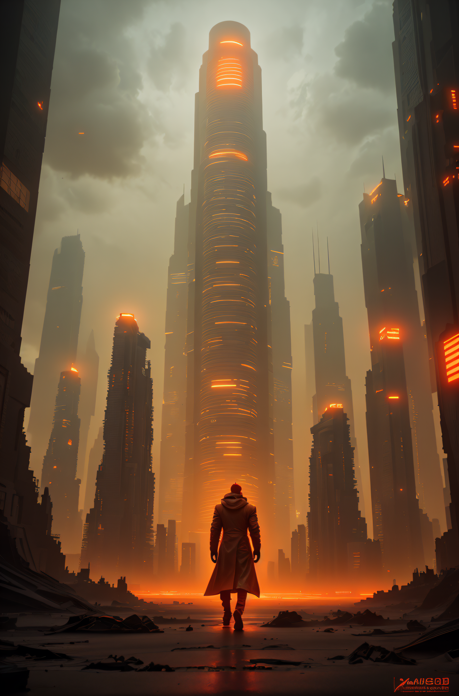
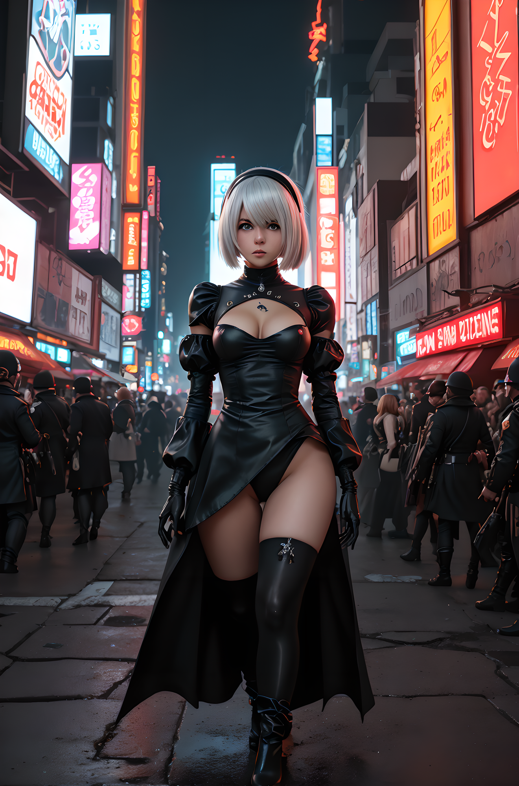
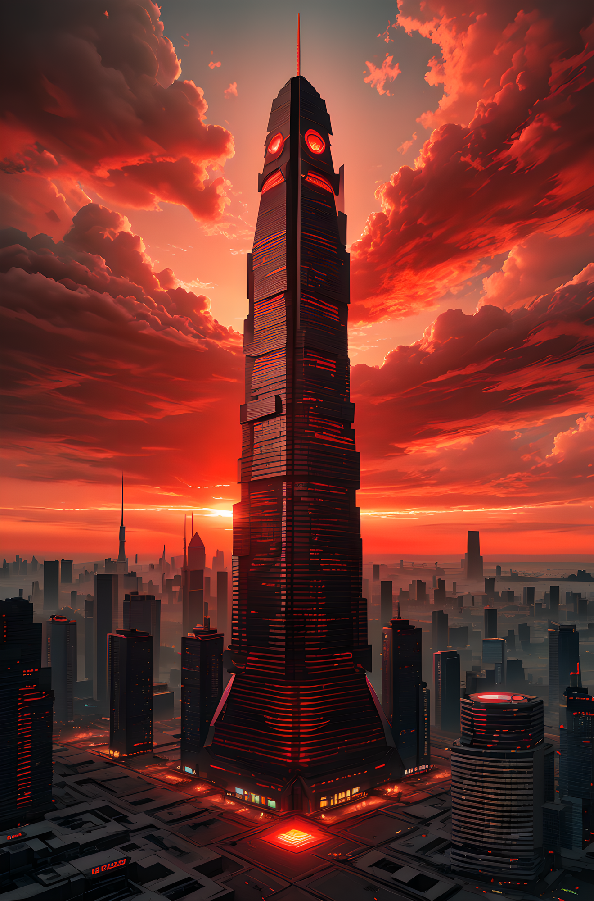

# 🌪️ Typhoon (SD1.5)

> **📢 UPDATE: Typhoon V2 has landed!**  
> Now with proper 768px-native training, higher-res LoRAs, and fewer anatomical crimes.  
> See [🌪️ Typhoon V2](#️typhoon-v2-sd15-768px-edition) below for full details.

A personal labor of chaotic love — **Typhoon** is a finely merged and experimentally-trained Stable Diffusion 1.5 model, balancing character fidelity, facial detail, and a very specific aesthetic sensibility. It’s been trained, broken, retrained, merged, unmerged, cried over, and eventually released into the wild. Now you get to enjoy it.

> _Note: This is the SD1.5 version. Same soul, slightly different tempers across versions._

---

---

## 🧪 Live Integration

Want to see Typhoon in action with a fully customized WebUI?

Check out **CipherCore-SD-1.5-WebUI** — a clean, fast interface built around Typhoon as the default model:

👉 [Raxephion/CipherCore-SD-1.5-WebUI](https://github.com/Raxephion/CipherCore-SD-1.5-WebUI)

This repo includes:
- Built-in Typhoon support (all versions)
- Optimized SD1.5 workflows
- Clean UI with minimal overhead
- Out-of-the-box settings tailored to the model
- Optimised for CPU
- Free for personal offline, local use

---

## 🧠 About

Typhoon started out simple — until it wasn’t. After multiple failed attempts (3 out of 4 training runs, to be exact) and renting GPUs for way too long, what finally emerged was a model that holds up remarkably well in portrait and stylistic renders.

It was trained using a mix of:
- First-stage full checkpoint finetuning
- LoRA training specific to each aesthetic goal
- Merging those LoRAs back in with… patience, math, and caffeine

To help make sense of this beautiful mess, I also built two tools to analyze merge quality:

- [LoRA Strength Analyzer](https://github.com/Raxephion/loRA-Strength-Analyser)
- [LoRA Epoch Analyzer](https://github.com/Raxephion/loRA-Epoch-Analyser)

They're in beta. Which means math happens, but sometimes weirdly.

---

## 📦 Typhoon Versions

### 🌪️ Typhoon V1

- Trained on 512x512 crops (regret lives here)
- Balanced, dreamy aesthetic with strong facial fidelity
- Merged with multiple LoRAs designed for portraiture and detail
- Performs surprisingly well across samplers and CFGs
- Still great for tag-heavy prompting

### 🌪️ Typhoon V2 (SD1.5, 768px Edition)

> 📸 Same seed. Same settings. Noticeably sharper.

Typhoon V2 is a full refresh:
- ✅ **768px-native** training (finally!)
- ✅ Entire dataset reprocessed, upscaled, and tagged better
- ✅ Cleaner anatomy, facial symmetry, and light handling
- ✅ Merged with new, high-res LoRAs trained from scratch
- ✅ More reliable with consistency + stylized fidelity
- ✅ Still tag-friendly — same prompting style applies

It retains the soul of V1 — but with fewer oddities, stronger detail retention, and much better high-res handling. You can drop it into your current workflows and expect it to just… work better.

V2 is now the **recommended default**.

---

## 📐 Recommended Settings

### V1 Defaults
- **Resolution:** 512x768 (or 576x768 for a slightly broader feel)
- **CFG Scale:** 7 (experiment 0.3–0.8 for softer output)
- **Sampler:** DPM++ 2M (Karras), Euler, or Euler a
- **Hires Fix:**  
  - Denoising: 0.7  
  - Upscale: 2x (Latent)  
  - CFG: 7

> No aDetailer or face fix required. Model handles facial detail well.

### V2 Adjustments (to be finalized in `settings.md`)
- Same samplers and CFG work well
- Hires fix denoising can drop to **0.5–0.6** for best edge retention
- Native 768px input allows for better aspect ratios — 768x1152 or similar

---

## ✨ Prompting Tips

Both versions of Typhoon respond best to **tag-like prompts** over natural language. The datasets were heavily captioned in this style, so stick to clean, concise tags for best results.

Examples:
- `masterpiece, 1girl, solo, detailed eyes, soft lighting, outdoors`
- `portrait, close-up, shallow depth of field, 4k, photorealistic`

---

## 📷 Sample Images

Sample images below use hires fix as described.  
**No LoRAs** applied — what you see is what the model outputs by default.

<table> <tr> <td></td> <td></td> <td></td> <td></td> <td></td> </tr> <tr> <td></td> <td></td> <td></td> <td></td> <td></td> </tr> </table>

---

## ⚠️ Limitations

- NSFW results are **hit or miss** — partially due to neutered base model. V2 fares better here, but no promises.
- Tag-style prompting works best. Prose prompts may cause drift.
- Anatomy isn't perfect. But it’s improving. The fairy visits more often now.

---

## 🚫 Usage Restrictions

This model is provided under a modified CreativeML Open RAIL-M license:

- ✅ Personal, private use is allowed and encouraged.
- ❌ **Do not merge** this model with other checkpoints or LoRAs — you’ll break the aesthetic.
- ❌ **Do not upload** to public generation sites or bots.

See the [LICENSE](./LICENSE) file for the boring legal bit.

---

## 📍 Attribution

- Base: Stable Diffusion 1.5 (`v1-5-pruned-emaonly`)  
- VAE: [stabilityai/sd-vae-ft-ema](https://huggingface.co/stabilityai/sd-vae-ft-ema)  
- LoRA analyzers: [Raxephion Tools](https://github.com/Raxephion)  
- Diffusers Repo: [Raxephion/Typhoon-SD1.5-V1](https://huggingface.co/Raxephion/Typhoon-SD1.5-V1)

---

### 🌩️ Enjoy the storm.
